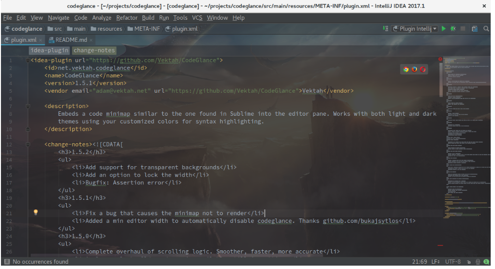

### 一、插件
----
1. CodeGlance（代码缩略图）
   

2. mongo (MongoDb插件)
   

3. rainbow-brackets

### 二、快捷键
---
1. Shift + F6：重命名变量
2. crtl + F6: 修改函数签名（函数名，函数参数），并自动更新相关引用。
3. ctrl + alt + f: 将表达式提取出来使其成为类的属性，并自动更新引用。
4. Ctrl + Alt + N: 内联
5. Ctrl + Alt + V: 提取变量
6. Ctrl + Alt + M: 提取方法
7. Ctrl + X: 删除行
8. Ctrl + D: 复制行
9. Ctrl + Alt + L: 格式化代码
10. ctrl + Shift + N: 通过文件名快速查找工程内的文件

